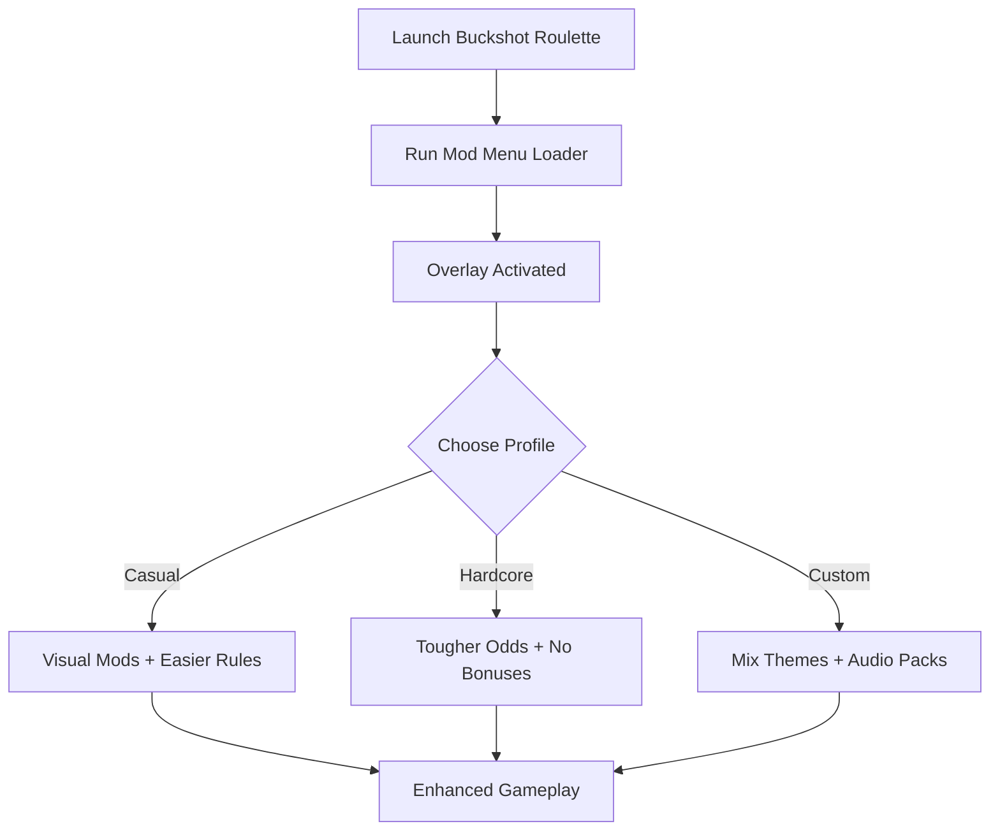

# Buckshot Roulette Mod Menu 🎲

**Buckshot Roulette** thrives on tension, risk, and unpredictable outcomes. But once you’ve experienced the base game, the **Buckshot Roulette Mod Menu** lets you push it further—adding **new rules, visual themes, audio packs, and balance tweaks**. It’s a modular system designed to give players creative control over their matches.

---

## 🌐 Overview

The Mod Menu acts as a **central hub** where you can toggle cheats, mods, and enhancements without digging through config files. Change chamber odds, swap table designs, enable special modes like **Double Barrel Roulette**, or apply audio packs—all in real time.

---

## 🔑 Features

* 🎮 **In-Game Menu Overlay** – Navigate mods with a simple interface.
* 🎯 **Rule Tweaks** – Adjust chamber odds, round counts, and penalties.
* 🎨 **Visual Themes** – Change table skins, card art, and UI colors.
* 🔊 **Audio Mods** – Swap sound effects or music for custom packs.
* 🗂 **Profile Loader** – Save setups for casual, hardcore, or party modes.
* ⌨️ **Hotkey Controls** – Toggle features instantly during play.
* 🔒 **Lightweight Build** – Runs with minimal system impact.

---

[](#)
[](#)
[](#)
[](#)

---

## 🖥 Compatibility

| Platform       | Status        | Notes                       |
| -------------- | ------------- | --------------------------- |
| Windows 10     | ✅ Supported   | Fully stable                |
| Windows 11     | ✅ Optimized   | Smooth overlays             |
| Linux (Proton) | ⚠️ Partial    | Menu may not load correctly |
| macOS          | ❌ Unsupported | VM workaround needed        |

\[!NOTE]
The Mod Menu is designed primarily for **Windows builds** with DirectX rendering.

---

## ⚙️ Setup Guide

1. Download the Buckshot Roulette Mod Menu.

2. Extract files into the `mods/` folder in your game directory.

3. Launch the game once to initialize.

4. Run the menu loader as administrator:

   ```bash
   buckshot_modmenu.exe -game buckshotroulette.exe -overlay on
   ```

5. Open the menu in-game with `F4`.

6. Configure modules via the menu or edit `modmenu.ini`:

   ```ini
   [Rules]
   ExtraRounds=2
   DoubleBarrel=True
   BonusChambers=Off

   [Visuals]
   Theme=Cyberpunk
   TableColor=Teal
   CardBack=Neon

   [Audio]
   SoundPack=Retro
   ```

\[!IMPORTANT]
Back up original files before installing new mods or themes.

---

## 📊 Menu Workflow



---

## 🎚 Example Configurations

**Casual Party Mode:**

```ini
ExtraRounds=3
DoubleBarrel=True
Theme=Classic
```

**Hardcore Mode:**

```ini
ExtraRounds=0
ChamberOdds=High
BonusChambers=False
```

**Themed Build:**

```ini
Theme=Horror
CardBack=BloodRed
SoundPack=Atmospheric
```

\[!WARNING]
Some mods may conflict if enabled together—test one by one.

---

## ❓ FAQ

**Q: Do mods installed via the menu affect online play?**
A: No, most are single-player only.

**Q: Can I add my own themes?**
A: Yes, custom assets can be dropped into the `themes/` folder.

**Q: Does it auto-update with new game patches?**
A: You’ll need to reinstall or update the menu after major patches.

**Q: How do I disable all mods quickly?**
A: Use the built-in “Default Reset” button in the menu.

**Q: Is it performance-heavy?**
A: No, it’s lightweight and optimized for low system load.

---

## 🚀 Final Thoughts

The **Buckshot Roulette Mod Menu** is the easiest way to manage mods, toggle rules, and customize visuals—all without editing files manually. Whether you’re looking for a lighthearted party setup or a brutal hardcore challenge, this menu puts the power in your hands.

[](#)
[](#)
[](#)

---
